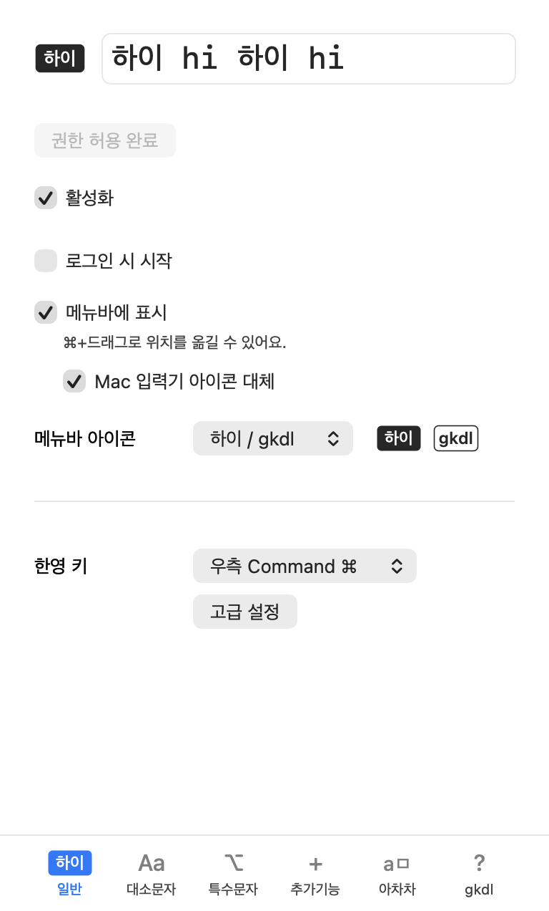
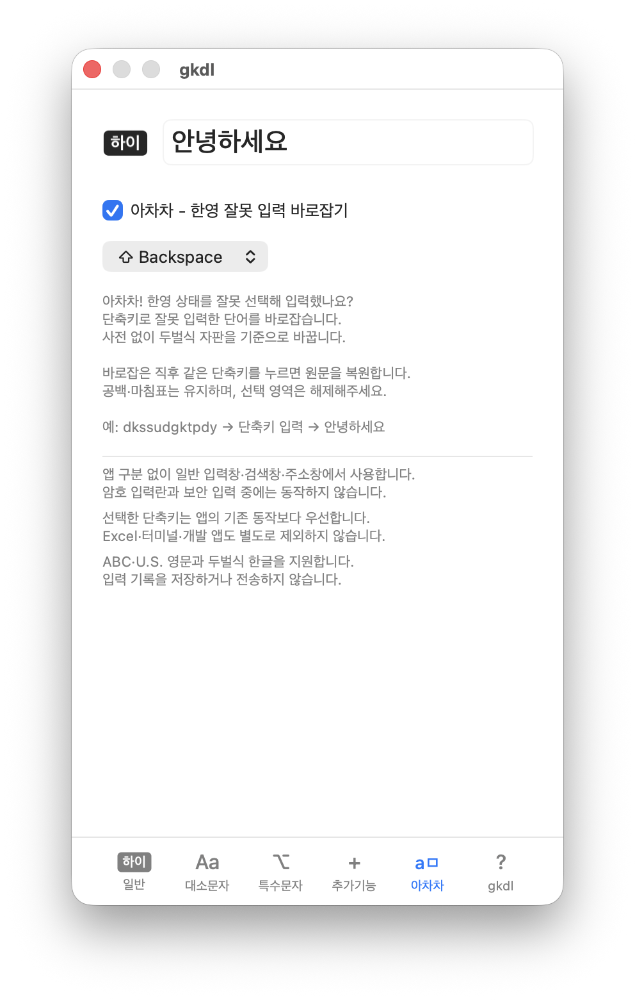
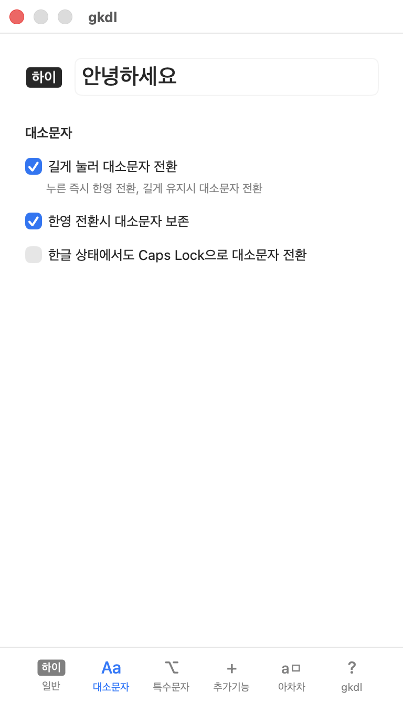
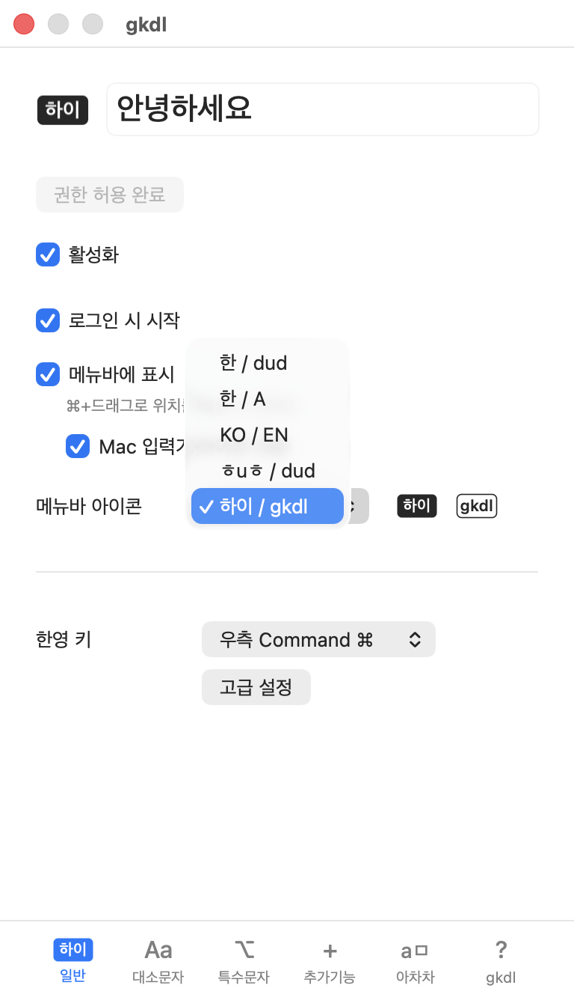

# gkdl · 하이

[gksdud](https://github.com/codingnoye/gksdud)에 **한영 오입력 바로잡기**를 더한 Mac 한영 전환 유틸리티입니다. 원작의 기능과 설정을 유지하며, Apple Developer ID 서명·공증을 거쳐 배포합니다.

**gkdl**

- **아차차**: 한영을 잘못 선택해 입력한 단어를 단축키로 바로잡기
- **하이 / gkdl**: 한글·영문 입력 상태를 표시하는 메뉴바 스타일
- **Apple Developer ID 서명·공증**: 최초 실행 시 자체 서명 앱의 별도 실행 허용 과정 생략

**gksdud**

- **한영 키 변경**: Caps Lock·오른쪽 Command·Shift + Space 등 원하는 키로 한영 전환
- **빠른 한영 전환**: 전환 딜레이와 키 씹힘 개선
- **대소문자 전환·보존**: 한영 키를 길게 눌러 대소문자 전환, 한영 전환 후에도 대문자 상태 유지
- **메뉴바 스타일 선택**: 한글·영문 입력 상태 표시와 아이콘 변경
- **특수문자 입력 설정**: 한글 상태에서도 Option 특수문자 입력 또는 비활성화
- **다국어 지원 (beta)**: 중국어·일본어 등 다른 입력 소스 전환




## 기능 안내

### 아차차 — 잘못 입력한 단어 바로잡기

한영 상태를 잘못 선택해 입력했다면, 단어 끝에서 **Shift + Backspace**를 누르세요.

- `dkssudgktpdy` → `안녕하세요`
- `10qnsenldp` → `10분뒤에`
- 반대 방향도 변환하며, 다른 입력 없이 같은 단축키를 다시 누르면 원문을 복원합니다.

**아차차** 탭에서 기능을 켜거나 끌 수 있으며, 단축키를 **Option + Space**로 바꿀 수 있습니다.



두벌식 자판을 기준으로 변환하며, 단축키를 눌렀을 때만 동작합니다. 사전·AI·네트워크·클립보드를 사용하지 않고 입력 내용을 저장하거나 전송하지 않습니다. 암호 입력란과 macOS 보안 입력에서는 동작하지 않습니다.

일반 입력창, 브라우저, 터미널에서 사용할 수 있지만 일부 입력창에서는 동작하지 않을 수 있습니다. 터미널에서는 gkdl 실행 중 직접 입력한 현재 단어를 바로잡습니다. 선택 영역이 있다면 해제한 뒤 단어 끝에서 사용하세요.

### 한영 전환과 대소문자

**일반** 탭에서 한영 전환에 사용할 키를 선택합니다. 키를 누르는 즉시 전환해 딜레이와 빠른 입력 중 키 씹힘을 줄입니다.

**대소문자** 탭에서는 다음 동작을 설정할 수 있습니다.

- **길게 눌러 대소문자 전환**: 누르는 즉시 한영을 전환하고, 길게 유지하면 대소문자를 전환합니다.
- **대문자 상태 보존**: 영문 대문자 상태에서 한글로 전환해도 영어로 돌아오면 대문자 상태를 유지합니다.



### 메뉴바 스타일

기본 스타일인 **하이 / gkdl**은 한글 상태에서 **하이**, 영문 상태에서 **gkdl**을 표시합니다.

**일반** 탭에서 원작의 **한 / dud**, **한 / A**, **KO / EN**, **ㅎuㅎ / dud**도 선택할 수 있습니다. 기존에 선택한 스타일은 유지합니다. 메뉴바 아이콘은 `Command + 드래그`로 위치를 옮길 수 있으며, 기존 입력기 아이콘을 대신해 사용할 수 있습니다.



### 특수문자와 다국어

- **특수문자** 탭: 한글 상태에서도 `Option + 문자`로 영어 입력 상태와 같은 특수문자를 입력하거나, Option 특수문자 입력을 비활성화할 수 있습니다.
- **추가기능** 탭: 중국어·일본어 등 다른 입력 소스를 한영 키로 순회하거나, 별도 키로 전환할 수 있습니다. 다국어 지원은 beta 기능입니다.


## 설치

**macOS 13 Ventura 이상 · Apple Silicon / Intel 지원**

Homebrew로 설치하려면:

```sh
brew install rioald/tap/gkdl
```

직접 설치하려면 [최신 릴리스](https://github.com/rioald/gkdl/releases/latest)에서 ZIP을 내려받아 압축을 풀고, `gkdl.app`을 **응용 프로그램** 폴더로 옮기세요.

### 처음 실행할 때

1. 메뉴바의 **gkdl 아이콘 → 설정**을 엽니다.
2. **접근성 권한 허용**을 누르고, **시스템 설정 → 개인정보 보호 및 보안 → 손쉬운 사용**에서 gkdl을 켭니다.
3. 접근성 권한을 허용하면 한영 전환과 아차차를 바로 사용할 수 있습니다. 필요하면 **일반** 탭에서 한영 전환 키를, **아차차** 탭에서 단축키를 바꾸세요.

새 설치에서는 **활성화**와 **로그인 시 시작**이 기본으로 선택됩니다. 기존에 끈 설정은 유지합니다. macOS에서 로그인 항목 승인을 요청하면 시스템 설정에서 허용하세요.

gkdl은 메뉴바에서 사용하는 앱입니다. 창이 보이지 않으면 메뉴바 아이콘에서 설정을 여세요. gksdud와 gkdl의 권한·설정은 별도이며, 두 앱을 동시에 활성화하지 마세요.


## 업데이트

설정의 **gkdl(?)** 탭에서 업데이트를 확인하고 설치할 수 있습니다. Homebrew로 설치했다면 다음 명령도 사용할 수 있습니다.

```sh
brew update
brew upgrade --greedy rioald/tap/gkdl
```

기존 ZIP 설치본을 Homebrew로 관리하거나 설치 오류를 해결하려면 [Homebrew 설치 안내](https://github.com/rioald/homebrew-tap#readme)를 참고하세요.


## 출처·라이선스

한영 전환 기능은 [gksdud](https://github.com/codingnoye/gksdud)를 기반으로 합니다. 원작의 기능과 동작 방식은 [gksdud v1.6.0 README](https://github.com/codingnoye/gksdud/blob/54debb68ac31bb11af372d671a730c74b7be2dd4/README.md)에서 확인할 수 있습니다.

gkdl · © 2026 rioald · [MIT](LICENSE)<br>
based on [gksdud](https://github.com/codingnoye/gksdud) · © 2026 CodingNoye · [MIT](LICENSE)
